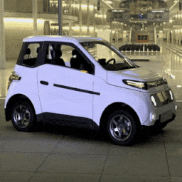
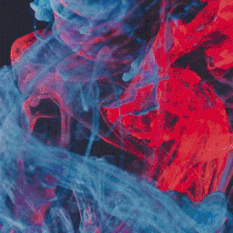
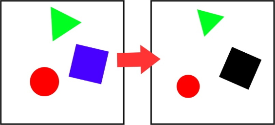

# Differentiable Morphing

### Image morphing without reference points by applying warp maps and optimizing over them.  
It called "differentiable morphing" because neuronal network here is not used in traditional data to label mapping sence, but as an easy way to solve optimisation problem where one image is mapped to another via warp maps that are found by gradient dicent. So after maps are found there is no need for the network itself.

## Results




## Dependencies

Tensorflow 2.4.0

## Usage

```bash
morph.py -s images/img_1.jpg -t images/img_2.jpg [-e 1000 -a 0.8 -m 0.8 -w 0.3]
```
-s Source file  
-t Target file  
  
Unnecessery parameters:  
-e Number of epochs to train maps on traning stage  
-a Addition map multiplyer  
-m Multiplication map multiplyer  
-w Warp map multiplyer  
  
## Idea

Suppose we want to produce one image from another in a way that we use as much useful information as possible, so if two given images share any similarities between them we make use of these similarities. 
  
  
  
After several trials I found out that the best way to achieve such effect is to use following formula.  
  
  
  
Here "Mult map" removes unnesecessery parts of an image and shifts color balance, "Add map" creates new colors that are not present in original image and "Warp map" distort an image in some way to reproduce shifting, rotation and scaling of objects. W operation is [dense_image_warp](https://www.tensorflow.org/addons/api_docs/python/tfa/image/dense_image_warp) method that present in tensorflow and usually used for optical flow estimation tasks. 
  
All maps are found by gradient descent using very simple convolution network. Now, by applying alpha scaling parameter to every map we will get smooth transition from one image to another without any loss of useful data (at least for the given toy example).  
  
 
  
  
## Thoughts

Notice, that all maps produced generate somewhat meaningful interpolation without any understanding of what exactly present in the images. That means that warp operation might be much more useful in images processing tasks. In some sense warp operation might be thought as long range convolution, because it can "grab" data from any point of an image and reshape it in some useful way. Therefore it might be beneficial to use warp operation in classification tasks and might allow networks be less susceptible to small perturbations of the data. But especially, it should be benefitial to use in generation task. It should be much easier to produce new data by combining and perturbating several examples of known data points than to learn a function that represents all data points at ones.
